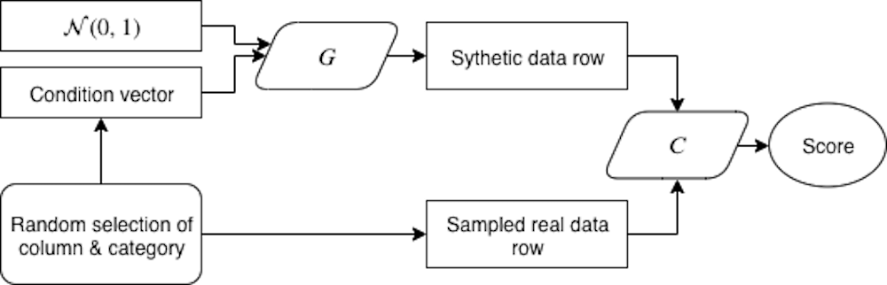
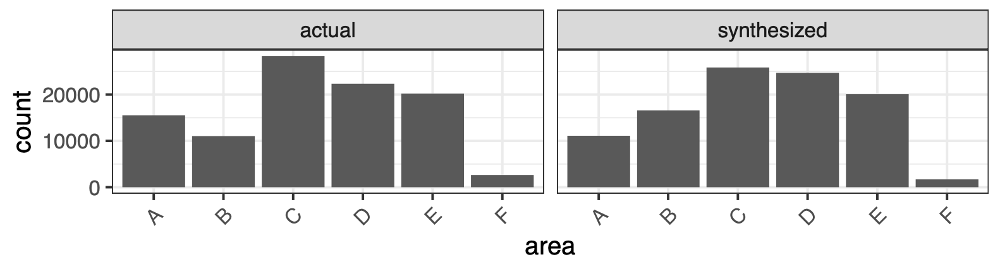
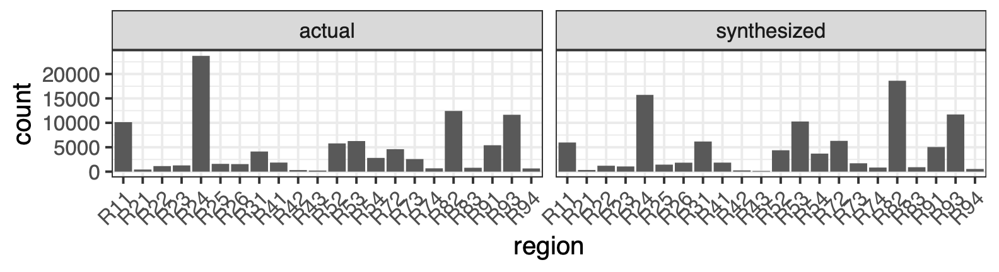
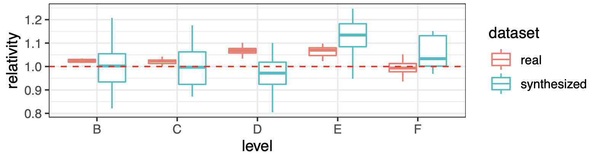
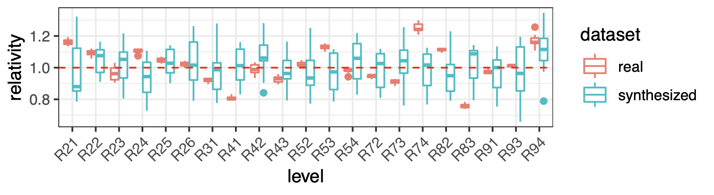

```{r setup, include=FALSE}
knitr::opts_chunk$set(echo = FALSE)
```

We introduce the [ctgan package](https://github.com/kasaai/ctgan)
for synthesizing datasets. This is meant to be a high level introduction to the 
research detailed in [*Generative Synthesis of Insurance Datasets*](https://arxiv.org/abs/1912.02423)[@kuo2019generative], which builds
on the work in [*Modeling Tabular data using Conditional GAN*](https://arxiv.org/abs/1907.00503)[@xu2019modeling].

For those of you who want to try the code right away, simply head over to the [GitHub
repo](https://github.com/kasaai/ctgan) which has instructions on getting started.

# Motivation 

Insurance datasets appropriate for research and software prototyping are often
difficult to find or don’t exist at all in the public domain. [Cellar](https://cellar.kasa.ai/) attempts to
solve the discoverability problem, and [simulationmachine](https://blog.kasa.ai/posts/simulation-machine/) provides a way to generate 
data for a very specific application (P&C reserving). By making CTGAN available to R users and 
performing initial explorations of insurance use cases, we hope to enable another
way for datasets to be available to everyone.

# "Dr. Conti"

A while back I came across a true-crime documentary, [*Sour Grapes*](https://en.wikipedia.org/wiki/Sour_Grapes_(2016_film)),
detailing the fascinating stint of Rudy Kurniawan, a wine counterfeiter who defrauded
collectors out of millions of dollars worth of bottles. Reportedly an astute taster, 
Kurniawan would, for example, blend inexpensive Napa Valley wines and fill them 
in old bottles of prestigious Bordeaux and pass them off as such at auctions. Because he had
access to many of the genuine bottles, he had plenty of data points to learn from. 
This process of coming up with realistic fake bottles, I felt, is a great analogy 
of adversarial generation of datasets.

# CTGAN

CTGAN is a method for generating tabular data proposed in a 2019 NeurIPS paper [@xu2019modeling]. 
Let’s first take a look at the architecture in Figure \@ref(fig:ctgan-arch).

```{r ctgan-arch, echo=FALSE, layout="l-body", fig.cap = "CTGAN architecture."}

```

Here, $G$ stands for Generator, or, in our case, the counterfeiter who comes up
with the blend, and $C$ stands for Critic, the taster who tries to distinguish a
fake bottle from an authentic one. Both the Generator and Critic are parameterized
by neural networks. During training, we randomly pick a categorical column and one
of its levels, then sample a row from our actual dataset with that particular value.
This is the “authentic bottle” that we’ll provide to our Critic.
At the same time, this selection of categorical column-level is, together with some randomness, 
passed to our Generator. Our Generator then produces a row of data, which is the
"fake bottle" passed to our Critic, who then has to decide which bottle is the fake 
one.

In the beginning of the training phase, neither $G$ or $C$ does very well---a casual
drinker new to wine would likely have a hard time telling the difference between 
a Grand Cru red Burgundy and a Charles Shaw Cab^[The former is made from Pinot Noir grapes, which are thin skinned and would look lighter in the glass, and have higher acidity. The latter, aka *Two Buck Chuck*, has a completely different flavor profile (and can be found at your local Trader Joe's for $3.99 for our American readers).]. However, as we provide more 
and more feedback to both, we'd hope they get better at their jobs.

# Insurance examples

To see how well ctgan works, we try it out on a couple well studied insurance datasets, 
one from P&C and one from Life. In one use case, we consider the French Motor Third 
Party Liability dataset for frequency modeling, and in the other we consider an SOA 
Experience Study dataset for shock lapse modeling. We evaluate the performance of 
the method via three perspectives:

1. Machine learning efficacy: how do predictive models trained on synthesized data 
perform relative to models trained on real data, when it comes to predicting responses
in actual holdout data?
2. Variable distribution similarity: do variable distributions, for both continuous 
and categorical variables, look similar across the synthesized and real datasets?
3. GLM coefficient similarity: do the coefficients for the models trained on synthesized
and real datasets exhibit similar patterns?

It turns out that for points 1 and 2, we do pretty well. Table \@ref(tab:rmse) shows 
the cross validated performance metrics^[The paper has details on how this cross-validation
is carried out].

```{r rmse, layout="l-body", echo=FALSE}
metrics_table <- tibble::tribble(
  ~Dataset, ~"Mean RMSE (Real Data)", ~"Mean RMSE (Synthetic Data)", ~"Relative Difference",
  "TPL Frequency", 0.2367, 0.2419, "2.21%",
  "Shock Lapse", 4.0038, 4.0203, "0.41%"
)

knitr::kable(metrics_table, caption = "Average cross-validated metrics of models trained on real and synthetic data.")
```

```{r distribution-area, echo=FALSE, layout="l-body", fig.cap = "Distributions of the Area variable."}

```

```{r distribution-region, echo=FALSE, layout="l-body", fig.cap = "Distributions of the Region variable."}

```

Figures \@ref(fig:distribution-area) and \@ref(fig:distribution-region) show
distributions of a couple variables for a synthesized dataset and its real counterpart. 
We see that they're similar enough, qualitatively, for the most part. Now, for
point 3, our method falls a bit short, at least in our experiments. For example,
in Figures \@ref(fig:relativties-area) and \@ref(fig:relativties-region) we show 
GLM relativities of models fit on real and synthesized datasets. Of course, YMMV when
it comes to your own datasets! All in all, perhaps our trained models won’t be able
to reproduce that ‘82 Latour, but it’d be able to come up with something that
resembles a Bordeaux blend.

```{r relativties-area, echo=FALSE, layout="l-body", fig.cap = "Relativities of the Area variable across cross-validated models."}

```

```{r relativties-region, echo=FALSE, layout="l-body", fig.cap = "Relativities of the Region variable across cross-validated models."}

```

# Conclusion

In this post, we provide a quick overview of the ctgan package and experiments 
on insurance datasets. We encourage you to try it out and perhaps start thinking 
about sharing some anonymized datasets :)
