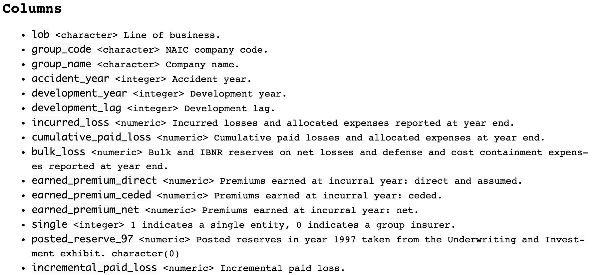
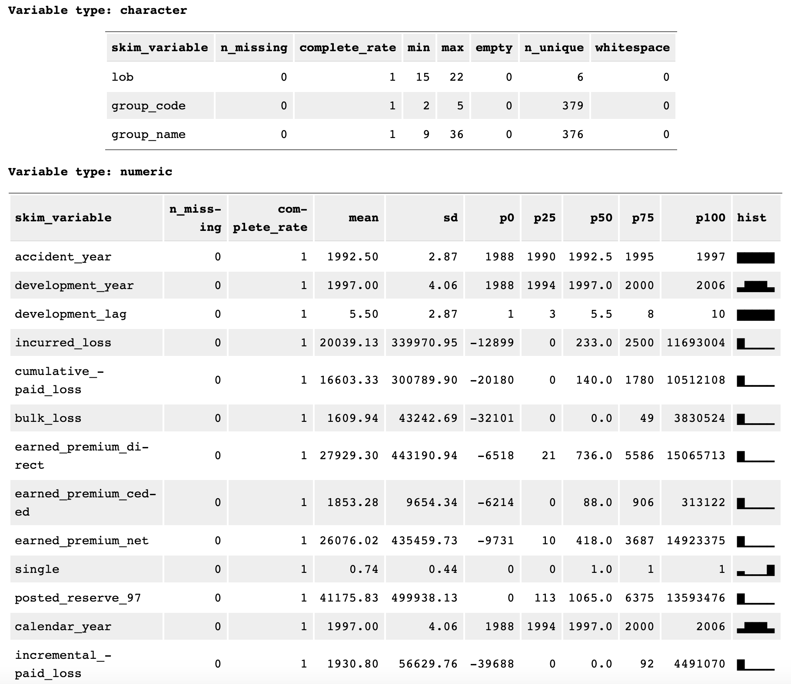

```{r setup, include=FALSE}
knitr::opts_chunk$set(echo = FALSE)
```

We're pleased to announce [Cellar](https://cellar.kasa.ai), a repository of publicly available datasets for insurance analytics research and engineering.

## Motivation

One of the most frequently cited issues in insurance-related reproducible research and open source software development is the scarcity of publicly available datasets. Compared to, say, image or language research, insurance does indeed fall behind in this respect. However, we believe that there is an interesting collection of datasets that exist on the Web today that is underutilized. These datasets are found in a variety of places, from websites (of researchers, actuarial societies, and governmental organizations) to self-hosted R packages, and they appear in an even greater variety of file formats and level of documentation. While folks "in the know" may be familiar with pockets of these resources, discoverability is lacking in the broader community. Through Cellar, we hope to encourage and accelerate knowledge building in the insurance analytics space.

## Quickstart

The [project website](https://cellar.kasa.ai/) is the recommended entry point to
get started. Practitioners can skim through the [datasets listing](https://cellar.kasa.ai/dataset/) 
and check out descriptions, data dictionaries (see Figure \@ref(fig:data-dictionary)), 
and variable statistics (see Figure \@ref(fig:variable-statistics)) of datasets
that may be of interest. 

```{r data-dictionary, echo=FALSE, layout="l-body", fig.cap = "Dataset column descriptions."}

```

```{r variable-statistics, echo=FALSE, layout="l-body", fig.cap = "Dataset column statistics."}

```

Then, with a single line of code, they can download the desired data to their R session:

```{r}
# install.packages("remotes")
# remotes::install_github("kasaai/cellar/r")

library(cellar)
schedule_p <- cellar_pull("schedule_p")
dplyr::glimpse(schedule_p)
```

## "Technical" details

For those interested, here is a concise list of Cellar's implementation details

- The data repository is implemented as a [pins](https://pins.rstudio.com/) board.
- The data currently lives in AWS S3; for those familiar with prior Cellar work, we have migrated from using GitHub releases to host files.
- Datasets are processed to be [tidy](https://tidyr.tidyverse.org/articles/tidy-data.html) and have consistently formatted column names where possible.
- Versioning (see *Vintage* information in the spec sheets) is supported, so users can document the exact versions of the datasets used in manuscripts or software.
- A Python library to access Cellar is on the roadmap and will be available later this year.

## Collaboration

Cellar is meant to be a community curated repository and we welcome contributions and requests to include new datasets. If there is a dataset you'd like to share, please stop by our [Slack](https://slack.kasa.ai), open a [GitHub issue](https://github.com/kasaai/cellar/issues), or reach out via [email](mailto:info@kasa.ai).

