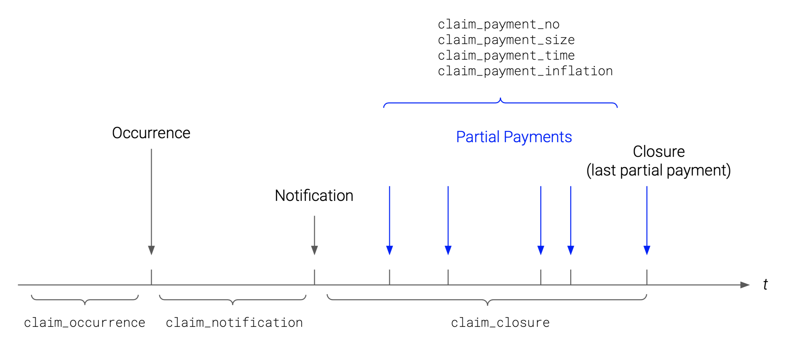

```{r setup, include=FALSE}
knitr::opts_chunk$set(echo = TRUE)
```

In this blog we introduce the individual claim simulator [`SynthETIC`](https://CRAN.R-project.org/package=SynthETIC)[@R-SynthETIC] (**S**ynthetic **E**xperience **T**racking **I**nsurance **C**laims), recently released on the [Comprehensive R Archive Network (CRAN)](https://cran.r-project.org). An associated paper can be found [here](https://arxiv.org/abs/2008.05693)[@20AvTaWaWo]. `SynthETIC` generates various features of non-life insurance claims on an individual claim level, including occurrence, notification, the timing and magnitude of individual partial payments, and closure.

```{r, echo=FALSE, layout="l-body", fig.cap = "Development of an individual non-life insurance claim."}

```

# Motivation

Recent years have seen rapid increase in the application of machine learning (ML) to insurance loss reserving. These ML methods yield most value when applied to large data sets, such as individual claim, even transactional, data sets, whose volume implies that a naked-eye view of the data features is impossible.

Unfortunately, such large data sets are in short supply in the actuarial literature, and so there is a shortfall in the material required to test ML methods. `SynthETIC` fills this gap and offers a starting point for the testing of proposed ML methods by **providing synthetic data that reflects complex features commonly observed in real data**.

The default version of `SynthETIC` is parameterized to loosely resemble the experience of a specific (but anonymous) Auto Bodily Injury portfolio ("reference portfolio"). However, the general structure is suitable for most lines of business, with some possible amendment on the choice of parameters and/or the structure of the sampling distribution(s). In short, `SynthETIC` gives the user **full control of the mechanics** of the evolution of an individual claim, hence the flexibility to create claims data of any level of complexity.

Indeed, the user may generate a collection of data sets that provide a spectrum of complexity, and the collection may be used to present a model under test with a steadily increasing challenge.

# Architecture of `SynthETIC`

`SynthETIC` is composed of 8 modelling steps ("modules"), any one or more of which may be re-designed according to the user's requirements.

1.  *Claim occurrence*: claim frequency, claim occurrence times;
2.  *Claim size*: claim size in constant dollar values i.e. without inflation;
3.  *Claim notification*: notification delay (delay from occurrence to notification);
4.  *Claim closure*: settlement delay (delay from notification to closure);
5.  *Claim payment count*: number of partial payments;
6.  *Claim payment size*: sizes of partial payments in constant dollar values i.e. without inflation;
7.  *Claim payment time*: inter-partial-payment delays, partial payment times;
8.  *Claim inflation*: sizes of inflated partial payments (includes both base inflation and superimposed inflation, with the latter operating with respect to both claim occurrence time and payment time).

As mentioned earlier, `SynthETIC` is designed to be very flexible in modelling choices. The user can adjust the parameters in each simulation step (e.g. claim notification) without modifying the underlying algebraic structure of the simulator (Weibull distribution with parameters dependence on claim size and occurrence period). Alternatively, in cases where a change of structure is deemed necessary, the user may easily unplug any one of the default module and replace it with a version modified to their own purpose.

In either case, the module sequence - specified in Section 4.1 of the [paper](https://arxiv.org/abs/2008.05693)[@20AvTaWaWo] and reproduced above - should be maintained so that the assumed dependencies between the selected modules still hold. In particular, `SynthETIC` currently incorporates the following dependencies (refer to the [paper](https://arxiv.org/abs/2008.05693)[@20AvTaWaWo] for a more comprehensive overview of the data features):

-   Distribution of notification delay depends on claim size;
-   Distribution of notification delay also, conditional on claim size, varies from one occurrence period to another;
-   Likewise, distribution of settlement delay also depends on both the claim size and the claim occurrence period;
-   Number of partial payments required to settle a claim depends on claim size;
-   Timing of partial payments depends on claim size, occurrence time, and number of payments required;
-   Size of a partial payment depends on the sizes of those preceding;
-   Rates of payment period superimposed inflation depend on claim size, and vary from one payment period to another;
-   Likewise, rates of occurrence period superimposed inflation depend on claim size, and vary from one occurrence period to another (e.g. the built-in example data set superimposes the occurrence period inflation to reflect a legislative change that affected the claim experience of subsequent occurrence periods);

The presence of such dependencies can often cause awkwardness in modelling (e.g. incompatibility with chain-ladder reserving), but is necessary for the effective testing of proposed alternative models as it reflects the complicated claim experience seen in real data.

# Starter Demo

To install the [CRAN version of the package](https://CRAN.R-project.org/package=SynthETIC), do

```{r, eval = FALSE}
install.packages("SynthETIC")
```

To install the development version of the package from the GitHub repository (which can occasionally be more updated), do

```{r, eval = FALSE}
if (!require(remotes)) install.packages("remotes")
remotes::install_github("agi-lab/SynthETIC/SynthETIC", build_vignettes = TRUE)
```

After the installation, run

```{r, eval = FALSE}
library(SynthETIC)
```

to load the package.

For a quickstart, here we present the code that produces the built-in test data set, which has detailed records of 3,624 individual claims (and 18,983 partial payments) over 10 years of exposure. We will skip the modelling specifications, which are fully described in Section 4 of the [paper](https://arxiv.org/abs/2008.05693)[@20AvTaWaWo]. Readers can also view a [full code demonstration](https://cran.r-project.org/web/packages/SynthETIC/vignettes/SynthETIC-demo.html) by running

```{r, eval = FALSE}
RShowDoc("SynthETIC-demo", package = "SynthETIC")
```

after installation of the package. The [demo document](https://cran.r-project.org/web/packages/SynthETIC/vignettes/SynthETIC-demo.html) shows in detail the behind-the-scenes simulation steps along with instructions on how to modify those to tailor for alternative claim experience.

To get set up for `SynthETIC` simulation, users are required to define at the top of their code a `time_unit` and a reference value `ref_claim` via the `set_parameter()` function. The default implementation works with a `time_unit` of `1/4` (given as a fraction of a year), which means that time is measured in quarters (e.g. $t = 1$ represents the end of the first calendar quarter). Similarly, all payment amounts require a monetary unit to be specified. In the default setting all amounts are in AUD. However, both monetary and time units may require variation from one application to another.

The two package-wise global parameters, `time_unit` and `ref_claim`, enable the application of `SynthETIC` in contexts different from the default. For instance, letting `time_unit = 1/12` sets the simulator up to work with calendar months. The reference claim size `ref_claim` can be seen as a scaling parameter. In `SynthETIC`, the default distributional parameters are specified as multiples of `ref_claim` instead of hard-coded raw numbers. This allows users to easily simulate a synthetic portfolio with similar claim pattern but in a different currency, e.g. the reference claim size might be 1,000 USD or 1,000,000 KRW. Alternatively, some schemes of insurance define entitlements as multiples of a regulated reference claim size, and this latter may be used as the `SynthETIC` global parameter. The two global parameters extend the application of `SynthETIC`.

```{r, echo = TRUE}
library(SynthETIC)
set.seed(20200131)
set_parameters(ref_claim = 200000, time_unit = 1/4)

#########################################################################
##                      Simulation starts here                         ##
#########################################################################
# Module 1: Claim occurrence
n_vector <- claim_frequency(I = 40, E = 12000, freq = 0.03)
occurrence_times <- claim_occurrence(n_vector)
# Module 2: Claim size
claim_sizes <- claim_size(n_vector)
# Module 3: Claim notification
notidel <- claim_notification(n_vector, claim_sizes)
# Module 4: Claim settlement
setldel <- claim_closure(n_vector, claim_sizes)
# Module 5: Claim payment count
no_payments <- claim_payment_no(n_vector, claim_sizes)
# Module 6: Claim payment size
payment_sizes <- claim_payment_size(n_vector, claim_sizes, no_payments)
# Module 7: Claim payment time
payment_delays <- claim_payment_delay(
  n_vector, claim_sizes, no_payments, setldel)
payment_times <- claim_payment_time(
  n_vector, occurrence_times, notidel, payment_delays)
# Module 8: Claim inflation
demo_rate <- (1 + 0.02)^(1/4) - 1
base_inflation_past <- rep(demo_rate, times = 40)
base_inflation_future <- rep(demo_rate, times = 40)
base_inflation_vector <- c(base_inflation_past, base_inflation_future)
payment_inflated <- claim_payment_inflation(
	n_vector, payment_sizes, payment_times, occurrence_times, claim_sizes,
	base_inflation_vector)
```

The simulated quantities can be summarised on an individual claim level, or on a transactional level:

```{r, echo = TRUE}
# claim level data
claim_dataset <- generate_claim_dataset(
  frequency_vector = n_vector,
  occurrence_list = occurrence_times,
  claim_size_list = claim_sizes,
  notification_list = notidel,
  settlement_list = setldel,
  no_payments_list = no_payments
)
str(claim_dataset)
# transactional level data
all_claims <- claims(
  frequency_vector = n_vector,
  occurrence_list = occurrence_times,
  claim_size_list = claim_sizes,
  notification_list = notidel,
  settlement_list = setldel,
  no_payments_list = no_payments,
  payment_size_list = payment_sizes,
  payment_delay_list = payment_delays,
  payment_time_list = payment_times,
  payment_inflated_list = payment_inflated
)
transaction_dataset <- generate_transaction_dataset(
  all_claims,
  adjust = FALSE # keeps the original (potentially out-of-bound) simulated payment times
)
str(transaction_dataset)
```

The resulting data sets are now ready for testing of proposed loss reserving models.

```{r, echo = FALSE}
DT::datatable(claim_dataset, rownames = FALSE,
              caption = htmltools::tags$caption(
                "Table 1: Claim Data Set", style = 'caption-side: top; text-align: Left;'),
              options = list(scrollX = TRUE))
DT::datatable(transaction_dataset, rownames = FALSE,
              caption = htmltools::tags$caption(
                "Table 2: Transaction Data Set", style = 'caption-side: top; text-align: Left;'),
              options = list(scrollX = TRUE))
```

# The Built-In Example Data Set

The test data sets generated above loosely align with the claim experience of a particular Auto Liability portfolio. The test data sets are available as part of the package and can be directly loaded via

```{r, eval = FALSE}
data(test_claim_dataset, package = "SynthETIC")
data(test_transaction_dataset, package = "SynthETIC")
```

As a simple example, let's see how [a chain-ladder application](https://github.com/agi-lab/SynthETIC/blob/master/CL_Test_Dataset.xlsx) of the data observed up to the 40th occurrence quarter deviates from the "actual" amount of outstanding claims, simulated for payment quarters 41 to 79. `SynthETIC` offers functionalities for tabulation of the data by occurrence and development periods (with an option for the aggregate level e.g. quarterly, yearly), making the comparison with chain-ladder quite straight-forward:

```{r}
output_actual_cum <- claim_output(
	n_vector, payment_times, payment_inflated,
	aggregate_level = 1, incremental = FALSE)
```

The code above outputs a 40 × 40 cumulative payment square that summarises the claims by occurrence and development quarter. The table below compares the chain-ladder forecast of loss reserve and the "actual" loss as simulated for the unseen future. Unsurprisingly the chain-ladder performs very poorly, given the default data features by design (e.g. dependencies of multiple simulated quantities on the occurrence period, superimposed inflation operating with respect to payment period etc.) and the extent to which they breach chain ladder assumptions. Data sets such as this are useful for testing models that endeavour to represent data outside the scope of the chain-ladder.

------------------------------------------------------------------------------------------
Occurrence quarters    Target reserve (simulator)    Chain ladder estimate   \% Deviation
---------------------- ----------------------------- ---------------------- --------------
                       \$m                           \$m
                       
1 to 10                9.2	                         9.5                     3

11 to 20               26.2	                         54.6                    109

21 to 25               26.1	                         68.1                    161

26 to 30               61.8	                         103.4                   67

31                     20.5	 	                       22.4 	                 9

32		                 24.4	                         34.8		                 43

33		                 27.8 	                       35.5		                 27

34		                 30.1 	                       44.5	                   48

35		                 26.4	                         53.2	                   101

36		                 36.2	                         47.8 	                 32

37		                 33.0	                         66.4	                   101

38		                 43.1		                       44.9		                  4

39		                 39.0 	                       39.5	                    1

40		                 46.2	                         32.4	                   -30

**Total**              **450.0**                     **657.1**	             **46**
------------------------------------------------------------------------------------------

`SynthETIC` works with exact transaction times, i.e. time is measured on a continuous scale. This means we can also plot the payment pattern against development on a continuous scale:

```{r, fig.width=7, fig.height=6}
plot(all_claims)
```

The output can be used as a check for reasonableness of assumptions.

# Conclusion

This blog presents a newly released, [open source](https://github.com/agi-lab/SynthETIC) individual claim simulator, [`SynthETIC`](https://CRAN.R-project.org/package=SynthETIC), and highlights some of its main functionalities through a quick demo.

`SynthETIC` facilitates research in alternative loss reserving models by providing synthetic data that reflects the complex features observed in real data. The code has been structured in a modular form to maximise the flexibility of the simulator in accommodating alternative claim experience, while maintaining dependencies between selected modules. This flexibility enables the generation of a collection of realistic data sets (at both claim and transactional level) providing a spectrum of complexity with which to challenge a proposed machine learning model.
